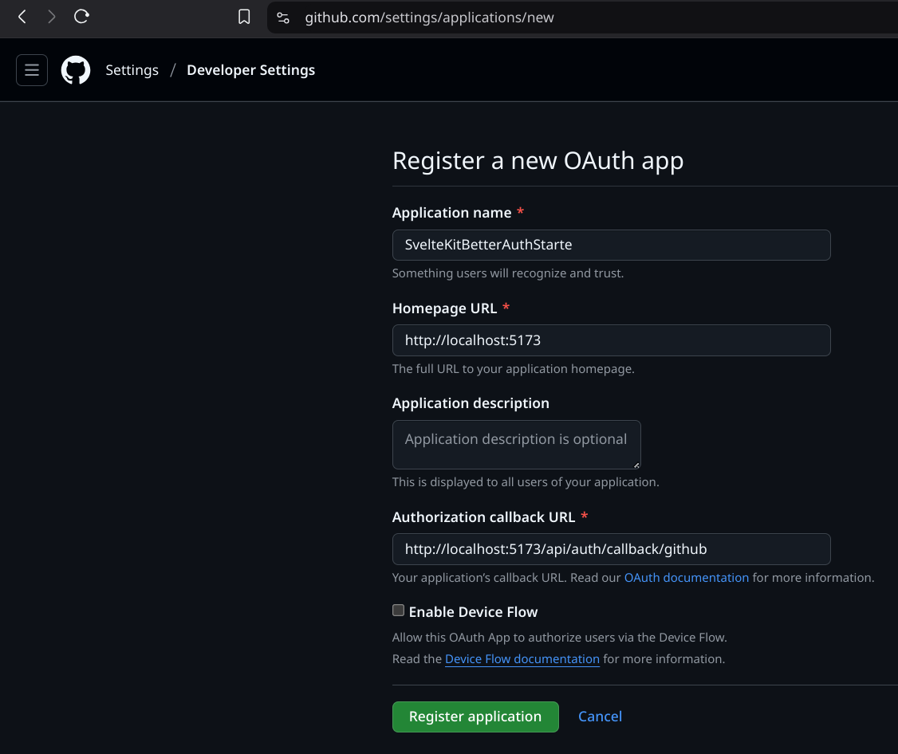

# NOTES

- [NOTES](#notes)
  - [Claude Links](#claude-links)
  - [Bootstrap SvelteKit App](#bootstrap-sveltekit-app)
  - [Svelte CLI](#svelte-cli)
  - [Run Project](#run-project)
  - [Configure BetterAuth](#configure-betterauth)
    - [Installation](#installation)
    - [SvelteKit Integration](#sveltekit-integration)
      - [Server Action Cookies](#server-action-cookies)
      - [Create a client](#create-a-client)
      - [Example usage](#example-usage)
      - [Add Providers and Keys](#add-providers-and-keys)
      - [Better Auth Callback URL](#better-auth-callback-url)
        - [GitHub](#github)
      - [Tying it all together](#tying-it-all-together)
  - [SurrealDb Kysely Dialet](#surrealdb-kysely-dialet)


## Claude Links

- [SvelteKit TypeScript Auth Integration Error](https://claude.ai/chat/2de507f4-f01a-4ffc-8aee-68b2886067c1)
- [SvelteKit Project Structure Best Practices](https://claude.ai/chat/82979701-8d9c-4754-bf0a-c2d1a5cf2a8c)

## Bootstrap SvelteKit App

```shell
$ mkdir -p /home/mario/Development/Svelte/SvelteKitBetterAuthStarter
$ cd /home/mario/Development/Svelte/SvelteKitBetterAuthStarter
$ cp ~/.nixshell/nix-shell-node.nix ./default.nix
$ echo "use nix" > .envrc && direnv allow
$ git init
$ git add .
$ git commit -am "first commit"
```

## Svelte CLI

- [Introducing the new Svelte CLI](https://svelte.dev/blog/sv-the-svelte-cli)

```shell
$ npx sv create
```

## Run Project

```shell
$ bun i
$ bun run dev
```

## Configure BetterAuth

### Installation

- [Installation | Better Auth](https://www.better-auth.com/docs/installation)

```shell
# add packages
$ bun add better-auth better-sqlite3
$ bun add --save-dev @types/better-sqlite3
```

add `auth.ts`

```shell
$ bunx @better-auth/cli generate
$ bunx @better-auth/cli migrate
```

### SvelteKit Integration

- [SvelteKit Integration | Better Auth](https://www.better-auth.com/docs/integrations/svelte-kit)

#### Server Action Cookies

add `sveltekitCookies` plugin to auth.ts

- `lib/auth.ts`

```ts
import { betterAuth } from "better-auth";
import { sveltekitCookies } from "better-auth/svelte-kit";
import { getRequestEvent } from "$app/server";
 
export const auth = betterAuth({
  // ... your config
  plugins: [sveltekitCookies(getRequestEvent)],
});
```

#### Create a client

- `lib/auth-client.ts`

```ts
import { createAuthClient } from "better-auth/svelte"
export const authClient = createAuthClient({
  // The base URL of the server (optional if you're using the same domain)
  // baseURL: "http://localhost:3000"
})
```

Once you have created the client, you can use it to **sign up**, **sign in**, and perform other actions. Some of the actions are reactive. The client use [nano-store](https://github.com/nanostores/nanostores) to store the state and reflect changes when there is a change like a user signing in or out affecting the session state.

#### Example usage

- `src/routes/+page.svelte`

```svelte
<script lang="ts">
  import { authClient } from "$lib/client";
  const session = authClient.useSession();
</script>
    <div>
      {#if $session.data}
        <div>
          <p>
            {$session?.data?.user.name}
          </p>
          <button
            on:click={async () => {
              await authClient.signOut();
            }}
          >
            Sign Out
          </button>
        </div>
      {:else}
        <button
          on:click={async () => {
            await authClient.signIn.social({
              provider: "github",
            });
          }}
        >
          Continue with GitHub
        </button>
      {/if}
    </div>
```

#### Add Providers and Keys

add bellow providers and update file `src/routes/+page.svelte`

#### Better Auth Callback URL

Better Auth requires configuring the callback URL for OAuth providers to ensure proper redirection after authentication. For local development, the redirect URL should be set to <http://localhost:3000/api/auth/callback/${providerName}>.
 For production, it should be set to your application domain, such as <https://example.com/api/auth/callback/${providerName}>.

When using Google as a social provider, the redirect URL must be configured in the Google Cloud Console under "Authorized redirect URIs".
Similarly, for GitHub, the redirect URL should be set to <http://localhost:3000/api/auth/callback/github> for local development and the appropriate domain for production.

##### GitHub

- [https://github.com/settings/developers](https://github.com/settings/developers)



- Client ID: Ov23litjt428TTZIqfi2
- Client Secret: 39d51c2f737b00.....

#### Tying it all together

- [Adding Better Auth to your Svelte 5 project](https://awingender.com/blog/better-auth-svelte-5-authentication/)

Usually, you will have some sort of part of your application that is protected as a whole, like a dashboard for your user. For this **dashboard**, we want to **check if the user is authenticated every time they try to access any part of it**.

In SvelteKit, you have the **concept of layouts**. Layouts are a way to **wrap your pages in a common layout**, perfectly suited for this use case.

The thing is, if we just created a `routes/auth` directory, **the path for any page under it would be** `/auth/....` This is not what we want. We want the layout `load function` to be able to **check it for all of them**, but not have the `/auth` prefix in the URL.

To achieve this, we can create a **layout group**. This way, we can create **layouts for all of the pages under the `(auth)` directory**, but not have the `/auth` prefix in the URL.

Enough talking, let’s create the **authenticated layout**. Create a new file in the `src/routes/(auth)` directory (create the directory if it doesn’t exist) called `+layout.server.ts`.

- `src/routes/(auth)/+layout.server.ts`

Now, create a new page under the `(auth)` directory called /dashboard/+page.svelte. On any page under the (auth) directory, you can access the user from the page data.

- `src/routes/(auth)/dashboard/+page.svelte`

Now, you should be able to achieve the following:

- Click the “Sign in with GitHub button
- Be redirected to the GitHub sign-in flow
- After completing the flow, be redirected to the `/dashboard` route
- See the user’s email on the page

## SurrealDb Kysely Dialet

- [GitHub - igalklebanov/kysely-surrealdb: Kysely dialects, plugins and other goodies for SurrealDB](https://github.com/igalklebanov/kysely-surrealdb)


https://www.better-auth.com/docs/examples/svelte-kit
https://github.com/better-auth/better-auth/tree/main/examples/svelte-kit-example